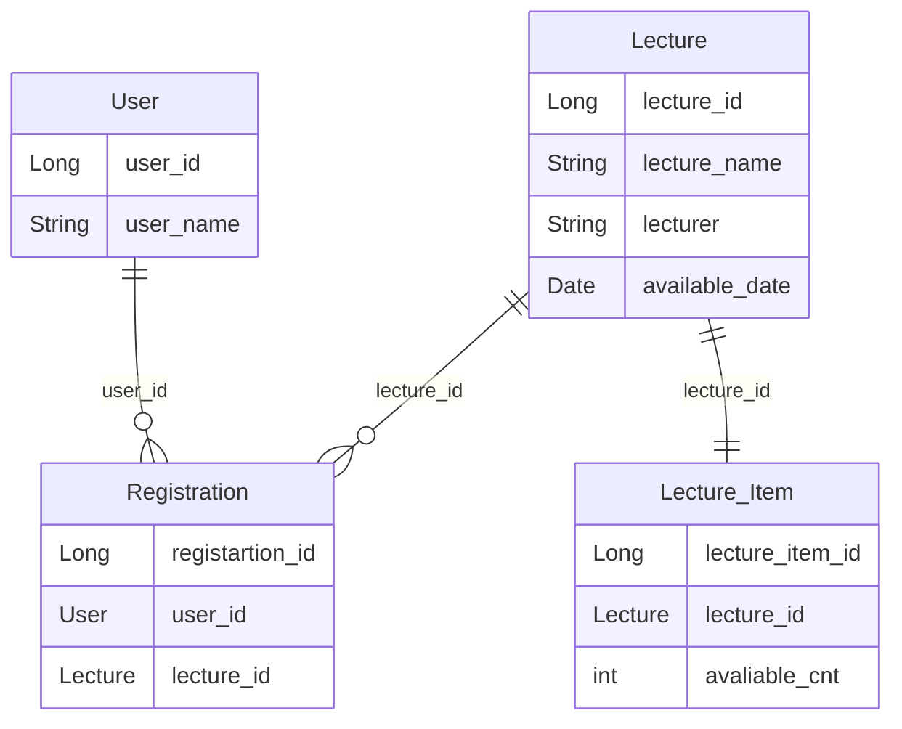

* N:M을 직접 사용도 해보기

## <관계성>
- 특강의 강연자가 중간에 변경할 수 있는 확장성을 고려해서 강연자의 테이블을 따로 빼놨다가,
  특강의 강연자가 바뀔일이 없다고 생각했습니다. (강연자의 사정으로 인해 취소는 되어도 다른 강연자가 와서 강연하지는 않음)
- `사용자는 여러 강의를 수강 신청할 수 있다.` 라는 부분에서 User-Registration을 1:N으로 생각했습니다.
- `수강은 여러 강의가 열린다.` 라는 부분에서 Lecture-Registration 1:N으로 생각했습니다.
- `사용자와 강의`는 결국 User-Lecutre N:M으로 이뤄지지만, Jpa에서는 N:M을 지양하기 떄문에 중간 단계인 `Registration`을 만들었습니다.
  지양하는 이유는
    1. `새로 추가될 컬럼은 엔티티에 매핑할 수 없습니다.`
    2. JPA에서 @ManyToMany은 조인 테이블을 생성 해주지만, `개발자가 조인 테이블을 활용할 수 있는 방법이 없습니다.`
    3. 다대다는 Join이 연속적으로 발생하기 때문에 `성능에 문제`가 발생할 수 있습니다.
       그렇기 때문에 저는 중간 테이블 Registration을 생성해 `N:M`을 풀어나갔습니다.

## <방향>
예시를 들어보겠습니다.

`사용자가 등록한 강의를 알 수 있는 것` 여기에서 끝나게 된다면, `단방향`입니다.

하지만, 이렇게 생각해봅시다. 

`사용자가 등록한 강의를 볼 수 있으며, 강의를 조회할 때 어떤 사용자들이 강의를 신청했는 지, 알 수 있는 것` 이것이 `양방향`입니다.

즉, 한글 뜻을 그대로 이해하는 것인 단방향: 한쪽으로만 향하는 것, 양방향 서로의 방향으로 향하는 것을 이야기할 수 있습니다.

방향성은 `DB`와 `객체`의 관점이 다른데요. `DB`테이블에는 `단방향 연관관계`라는 개념 자체가 존재하지 않고, 외래키를 참조했다면, 양쪽에서 참조가 가능합니다.

But! 객체 관점에서 생각해보면,
``` java
public class User {
	@Id
	@GeneratedValue(stratgey = GenertationType.IDENTITY)
	private Long id;

	@ManyToOne
	@JoinColumn(name = "registration_id")
	private Registration registration;
	// private Long registration_id;
}
```
와 같이 참조값을 생성해줘야 그제서야 방향이 생성됩니다.

## <연관 관계의 주인>
연관 관계의 주인이 무엇일까요? 바로 외래키를 가지고 있는 테이블이 중심이 됩니다.

처음에는 왜 그렇지?라며 이해가 되지 않았습니다.  사용자의 이름같은 것이 변경된다면, 그게 외래키에도 영향이 가서 사용자나 강의가 주인 아닌가 싶었는 데,

제가 착각한 부분이 있습니다! 바로 생각해야하는 건 테이블간의 관계였죠.

수강입장에서 봅시다. 수강입장에서는 "사용자의 이름이 변경되었어? 어쩌라고 그래봤자 넌 1번 사용자야 이름이 바뀌건 난 상관없어" 이 상태이기 때문이죠.

그렇기때문에 외래키를 가지고 있는, `수강 테이블이 주인 관계`입니다.

## <보안사항>
코칭을 받고 보안 사항이 생겼습니다. 

저는 당연히 `Lecture - Registration - User` 만 있으면 되는 거 아니야? 했는 데 종협 코치님께서, `동시성이 발생하는 필드는 분리`시키는 것이 좋다고 하셨습니다.

예를 들어 `Lecture`에 동시성 문제로 접근하지 못하게 된다면, `코치, 강의 제목, 등록 가능한 날짜`도 같이 접근할 수 없는 경우가 발생합니다.

하지만, `Lecture`과 `Lecture_Item`으로 나누게 된다면, `Lectrure_Item`이 잠긴다면, 여전히 `Lecture`의 `코치, 강의 제목, 등록 가능한 날짜`은 여전히 읽기가 됩니다.

그래서 `Lecture_Item`에 수강 신청할 수 있는 `인원 수`만 `1:1`로 연관 관계를 지정하겠습니다.

추가적으로 `각 항목은 특강 ID 및 이름, 강연자 정보를 담고 있어야 합니다.` 라는 요구사항이 있어서, Lecture에는 특강 ID, 이름, 강연자 정보만 가지고 있으면 되기 때문에 테이블의 정보를 그대로 가져와서 쓰면 되게 끔 `Lecture_Item`을 나누면 될 것 같습니다.

```
정리하자면 
보안 사항은 `Lecture`의 수강 신청 가능한 날짜와 수강 신청 인원을 따로 분리

그 이유는
    동시성으로 인해 테이블에 접근할 수 없게 된다면, 
    시성과 관련 없는 필드는 접근할 수 있게 분리하기 위해서 입니다.
```

--- 

## ERD


